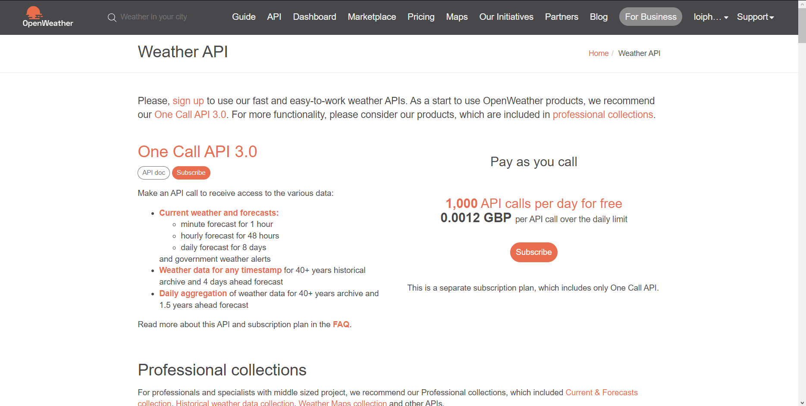
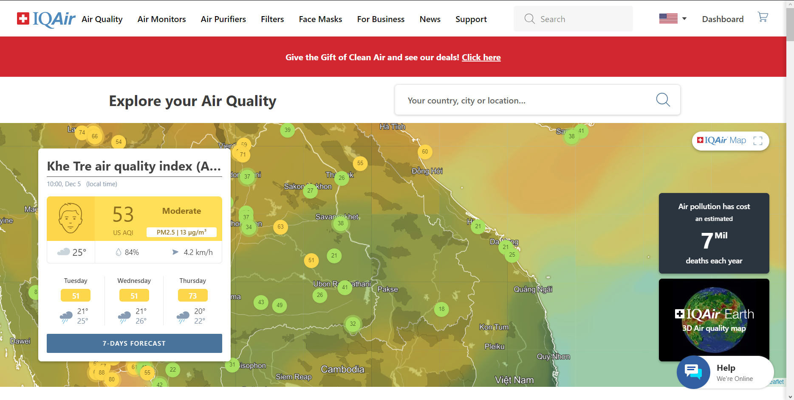
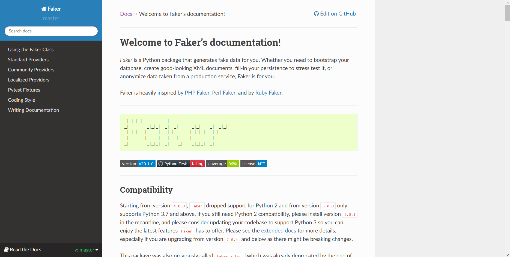
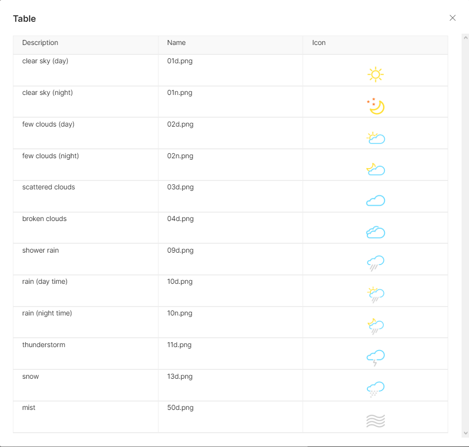

# Data Pipeline Project

## Overview
- This is my first assignment in EEET2574 - Big Data for Engineering (RMIT University)
- This guide will walk you through the process of setting up Docker containers for Kafka and Cassandra, along with producers and consumers, to create a data pipeline. The data pipeline will fetch weather information from OpenWeatherMap and store it in Cassandra, with the option for data visualization.
- The origin structure: https://github.com/salcaino/sfucmpt733

## Tools & Technologies

- **Python 3.x:** The project is primarily written in Python to take advantage of its versatility and extensive ecosystem of libraries.

- **Apache Kafka:** Kafka is used as a distributed event streaming platform to facilitate the real-time ingestion of data from multiple sources.

- **Apache Cassandra:** Cassandra serves as the NoSQL database for storing and retrieving the processed data efficiently.

- **Jupyter Notebook:** Jupyter Notebooks are employed for data visualization and exploratory data analysis. They provide an interactive and user-friendly environment for data scientists and analysts.

- **Docker:** The project is containerized using Docker, enabling seamless deployment across different environments and simplifying dependencies management.

- **Visual Studio Code (VSCode):** VSCode is the integrated development environment (IDE) of choice for coding. It offers robust support for Python development and Docker integration.

- **Windows Terminal:** Windows Terminal provides a unified command-line interface for executing commands and managing the project.

## APIs
The project integrates with the following APIs:

- OpenWeather API: Used for retrieving weather data for inclusion in the data pipeline. Link: https://openweathermap.org/api


- IQAir API: Utilized to gather air quality information for integration into the data processing workflow. Link: https://www.iqair.com/us/


- Faker: Faker is used for generating synthetic or fake data during the development and testing phases.



## Prerequisites

Before using the data pipeline, ensure the following prerequisites are met:
- Python 3.x installed
- Docker installed for containerization

## Getting Started

### Installation
Clone the repository to your local machine:

```bash
git clone https://github.com/DeathHunterX/Simple-datapipeline.git

cd Simple-datapipeline
# or
cd */Simple-datapipeline
```
### Configuration
Add or edit the configuration settings in owm-producer and iqair-producer folders to match your environment and data sources. (If you do that already, please ignore it)

```bash
# Use terminal to apply below command

# For own-producer (OpenWeather API)
echo [openweathermap_api_credential] > owm-producer/openweathermap_service.cfg
echo access_token=your_api_key >> owm-producer/openweathermap_service.cfg

# For iqair-producer (IQAir API)
echo [iqairmap_api_credential] > iqair-producer/iqairmap_service.cfg
echo access_token=your_api_key >> iqair-producer/iqairmap_service.cfg
```

## Usage
### Running the Pipeline

1. Create network for Kafka and Cassandra
```bash
docker network create kafka-network
docker network create cassandra-network
docker network ls   # Check if successfully created
```

2. Set up Kafka and Cassandra containers 
```bash
# Run Kafka and Cassandra 
docker-compose -f cassandra/docker-compose.yml up -d
docker-compose -f kafka/docker-compose.yml up -d

# Check all running containers if Kafka and Cassandra are running
docker ps -a    
```

3. Access Kafka UI frontend

- Open http://localhost:9000 (username: admin; password: bigbang)

- Add a data pipeline cluster:
    + Cluster Name: mycluster
    + Cluster Zookeeper: zookeeper:2181

- Enable the following options:
    + Enable JMX Polling
    + Poll consumer information
    + Enable Active OffsetCache Click Save.  

4. Open WSL or Ubuntu and execute this command. It will 
. If the output is `["twittersink","weathersink","fakersink", "iqairsink"]`, skip Step 5. Otherwise, go to next step

```bash
# Check if all sink from Kafka is created. If not, go to Step 5 and check it again, else skip next step
curl -X GET http://localhost:8083/connectors
```

5. Access to kafka-connect shell and run this command (this is a bug so you need to run it indirect)
```bash
./start-and-wait.sh
```

6. Initialize Provider and Consumer for Kafka with 3 different APIs
```bash
# Provider
# Open Weather API
docker-compose -f owm-producer/docker-compose.yml up -d
# Faker API
docker-compose -f faker-producer/docker-compose.yml up -d
# IQAir API
docker-compose -f iqair-producer/docker-compose.yml up -d

# Consumer
docker-compose -f consumers/docker-compose.yml up -d
```

7. Open Cassandra via Docker and check if all the data has been flowed to the database
```bash
# run it to access Cassandra
docker exec -it cassandra bash

# Access Cassandra Shell
cqlsh

# Check all keyspaces
desc keyspaces;

use kafkapipeline;

# Check all tables in a keyspace
desc tables;

# Check data
select * from weatherreport;
select * from fakerdata;
select * from iqairdata;

# Exit Cassandra Shell
exit

# Exit Docker Container
exit
```

8. Set up Data Visualization
```bash
docker-compose -f data-vis/docker-compose.yml up -d
```
Open http://localhost:8888 for data visualization.

Now, you have successfully set up the Docker containers for Kafka and Cassandra, created a data pipeline, and visualized the data.

Note:
- Cassandra will lose data if you don't use for at least 12 hours
- Kafka broker has bug which when you try to rerun Kafka, it will get crashed or if you try to rerun it again, it will work but not for functionality. So one way to fix it is delete Kafka container and rebuild it again.

## Data Dictionary
- Open Weather API:
    + `forecastdate`: The timestamp representing the date and time of the weather forecast.
    + `location`: The name of the city for which the weather forecast     + `is recorded.
    + `description`: A textual description of the weather condition   + `(e.g., Clear, Clouds, Rain).
    + `temp`: The current temperature at the location.
    + `feels_like`: The "feels like" temperature, indicating how the  + `weather feels to a person.
    + `temp_min`: The minimum temperature expected for the forecast   + `period.
    + `temp_max`: The maximum temperature expected for the forecast   + `period.
    + `pressure`: Atmospheric pressure at the location.
    + `humidity`: The percentage of humidity in the air.
    + `wind`: The wind speed at the location.
    + `sunrise`: The timestamp of the sunrise time.
    + `sunset`: The timestamp of the sunset time.

- Faker API:
    + `id`: Identifier for the generated fake data record.
    + `street`: The street address.
    + `streetname`: The name of the street.
    + `buildingnumber`: The building number in the street address.
    + `city`: The name of the city.
    + `zipcode`: The postal code or ZIP code.
    + `country`: The name of the country.
    + `country_code`: The code representing the country.
    + `latitude`: The latitude coordinate of the location.
    + `longitude`: The longitude coordinate of the location.

- IQAir API:
    + `city`: The name of the city.
    + `state`: The state or region associated with the city.
    + `country`: The name of the country.
    + `latitude`: The latitude coordinate of the location.
    + `longitude`: The longitude coordinate of the location.
    + `current_ts`: Timestamp representing the current date and time.
    + `current_pollution_aqius`: The Air Quality Index (AQI) value based on US EPA standard.
    + `current_pollution_mainus`: The main pollutant for US AQI.
    + `current_pollution_aqicn`: The Air Quality Index (AQI) value based on China MEP standard.
    + `current_pollution_maincn`: The main pollutant for Chinese AQI.
    + `current_weather_tp`: The current temperature in Celsius.
    + `current_weather_pr`: The atmospheric pressure in hPa.
    + `current_weather_hu`: The humidity percentage.
    + `current_weather_ws`: The wind speed (m/s).
    + `current_weather_wd`: The wind direction, as an angle of 360° (N=0, E=90, S=180, W=270).
    + `current_weather_ic`: The icon code representing the current weather condition.
    
    Ref: https://api-docs.iqair.com

## Visualization and Analysis
### 1. Temperature in Celsius for Duration of Time
- Description:

This line graph demonstrates the continual and various changes of temperature in Celsius, which helps provide insights of the climate patterns. Knowing the trends of fluctuations is significant for evaluating climate changes that may influence the dispersion and concentration of pollutants in urban areas.

- Interpretation:

The chart provides an overview of temperature trends, which are foundational for understanding climate dynamics. Extreme temperatures is capable of affecting the stability of air masses, potentially influencing the dispersion of pollutants in urban environments. Analyzing temperature patterns assists in anticipating weather conditions that might exacerbate or mitigate air pollution.

### 2. Air Pressure in hPa for Duration of Time
- Description:

In order to serve as a main criterion of weather patterns, the graph captures atmospheric pressure changes in hectopascals (hPa) continuously. Variations in air pressure can influence wind patterns and air circulation, impacting how pollutants disperse in urban areas.

- Interpretation:

The chart provides insights into atmospheric conditions, providing assistance to predict weather changes that could affect air quality in metropolitan areas. High or low-pressure systems may influence the stagnation or rapid movement of pollutants, impacting their concentration levels. Having clear insights regarding this matter can pontentially help relevant bodies develop innovative strategies to tackle this issue.

### 3. AQI (Air Quality Index) Value Based on US EPA Standard for Duration of Time
- Description:

The AQI chart represents air quality fluctuations based on the US EPA standard, pointing out the levels of pollution in urban areas. It provides a direct measure of how local weather conditions and climate factors contribute to the accumulation of pollutants.

- Interpretation:

The chart provides a direct representation of air quality, which reflects the impact of weather and climate on urban pollution levels. Understanding AQI trends over time allows for the identification of periods of heightened pollution, which can be correlated with specific weather and climate conditions. This information is important for implementing targeted measures to reduce human-caused air pollution in urban areas.

### Connection and Implication
A thorough knowledge of the dynamic relation between weather, climate, and air quality in urban regions can be summarized and highlighted through the analysis of these visualization plots as a whole. By identifying movements and connections, local governments and environmentalists can implement applicable steps to reduce human-caused air pollution. Having a solid understanding of how temperature shifts or low-pressure systems affect pollutant concentrations can aid in making data-driven judgments when it comes to implementing emissions control measures. Acknowledging the connection between high temperatures and excessive energy usage can also assist direct efforts in metropolitan areas to encourage sustainable energy sources. To sum up, this combined technique contributes to the development of effective and data-driven measures to improve air quality and lower the environmental impact of human activities in each country.

## License
This project is licensed under the MIT License. Feel free to use, modify, and distribute the code as needed.